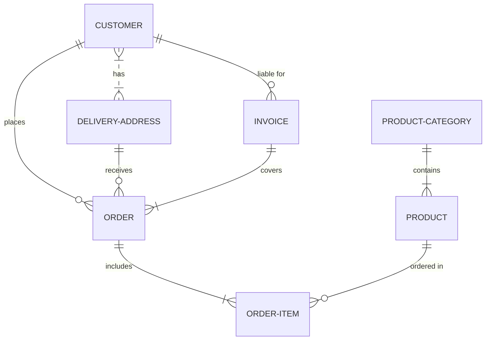
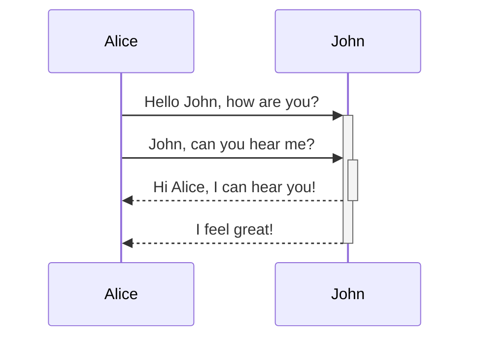
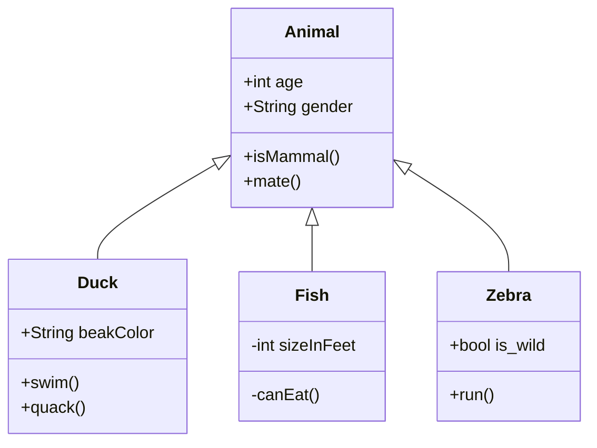
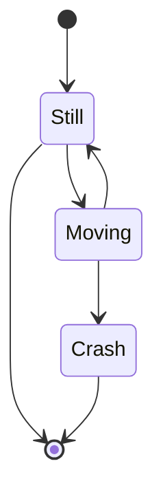

# KnowledgeBase

# Create Custom Diagrams in Visual Studio Code

Create flowless digram type "on the fly" using Visual Studio Code and the mermaid Plugin Preview for VisualStudio Code as an extension in your Development Environment and Oracle APEX.


## ER-Diagram (Entity Relationship Modeling)


<HR>

## Sequence Diagrams 


<HR>

## Class Diagrams (Object Oriented Modelling)



<HR>



Code Preview Window using COPY and PASTE functionality.

```
<html>
    <code>
    </code>
</html>
```


